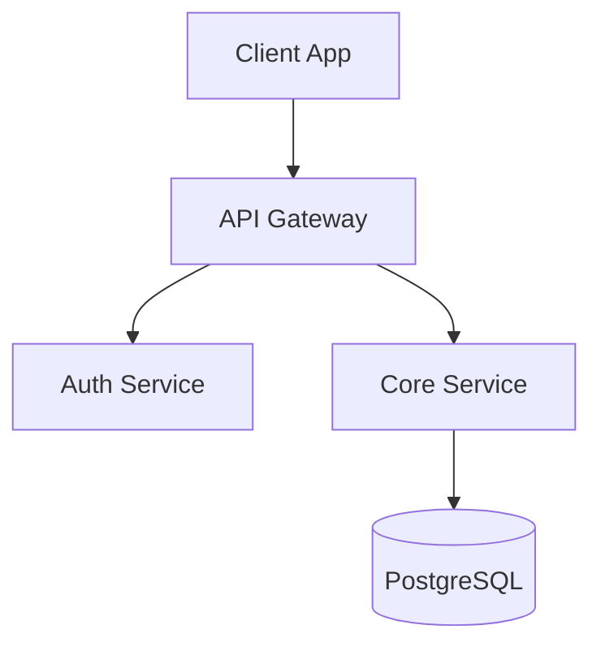

# Damodar

[](https://gohugo.io/)
[](LICENSE)
[]()

A clean, fast, documentation-and-notes Hugo theme designed for engineers, researchers, and technical writers. Features a sticky left sidebar, collapsible section hierarchy, keyboard-driven search modal, dual-theme syntax highlighting, reading progress tracking, responsive image pipelines, and distraction-free typography tuned for long-form reading.

---

## Key Features

- 🔍 **Dual-Engine Search**: Keyboard-driven modal dialog (`⌘K` / `Ctrl+K` or `/`) with native [Pagefind](https://pagefind.app/) indexing (`data-pagefind-*` hooks) and automatic fallback to a zero-config client-side JSON search index.
- 🌓 **Flicker-Free Dark/Light Mode**: Inline blocking detection prevents FOUC, synchronized with system color preferences (`prefers-color-scheme`) and persistent via `localStorage`. Live re-renders diagrams when switching themes.
- 🌲 **Sticky Navigation & Dynamic TOC**: Contextual sidebar displaying "ON THIS PAGE" for articles and "NAVIGATION" for section browsing. The scroll-spy Table of Contents tracks reading progress up to 100% on long articles while automatically suppressing the progress bar on short notes that fit comfortably on screen.
- 🎨 **Architectural Patterned Footer**: Full-width footer featuring a subtle geometric dotted matrix pattern, glowing luminescent accent border, multi-column navigation, social/feed badges, and interactive keyboard shortcuts trigger.
- ⌨️ **Keyboard Hotkeys & Navigation**: Global shortcuts modal (<kbd>?</kbd>), theme toggle (<kbd>T</kbd>), sequential article navigation (<kbd>J</kbd> / <kbd>K</kbd>), and home shortcut (<kbd>H</kbd>).
- 🧩 **Interactive Component Shortcodes**: Accessible multi-language tabs (``), collapsible accordions (``), visual directory file trees (``), and admonitions (``).
- 🖼️ **Image Lightbox & Footnote Popovers**: Zero-dependency click-to-zoom image lightbox with backdrop blur, and in-place hover/click footnote tooltips.
- ⚡ **Enhanced Markdown Render Hooks**:
  - **Code Blocks**: Header bar with language badges, optional filename/title displays, and one-click Clipboard API copy button.
  - **Headings**: Clean, accessible permalink anchors (`#`) on hover and focus for `<h2>`–`<h6>`.
  - **Images**: Automatic `<picture>` element generation with Hugo Pipes WebP and AVIF conversions, responsive `srcset`, `loading="lazy"`, and `decoding="async"`.
  - **Links**: Smart external link detection appending `target="_blank"` and `rel="noopener noreferrer"` while preserving relative internal links.
- 🚀 **Instant Navigation & Performance**: W3C Speculation Rules API and mouseover prefetching for sub-millisecond page transitions.
- 📐 **Conditional KaTeX & Mermaid.js**: Zero-bloat conditional asset loading when `math: true` or `mermaid: true` is defined in page front matter, with live theme re-rendering.
- 💡 **Callouts & GitHub-Style Alerts**: Dedicated shortcodes and automated styling for GitHub markdown alerts (`[!NOTE]`, `[!TIP]`, `[!IMPORTANT]`, `[!WARNING]`, `[!CAUTION]`, `[!DANGER]`).
- ✍️ **Author Bio, Share & GitHub Edit**: Rich author profile cards with avatars and social links, one-click link copying, social sharing, and direct GitHub content editing links.
- 📜 **Chronological Timeline Archive**: Dedicated archive page layout grouping all posts by year with tag badges and count statistics.
- 🖨️ **Distraction-Free Print / PDF Styling**: Dedicated `@media print` rules hiding navigation and chrome for clean paper and PDF exports.
- 📚 **Series & Related Content**: In-article `series` taxonomy navigation box and automated 2–3 card related posts section powered by Hugo's related content engine.
- 💬 **Privacy-Friendly Comments & Analytics**: Pluggable GitHub discussions ([Giscus](https://giscus.app/) & [Utterances](https://utteranc.es/)) alongside privacy-respecting analytics ([Plausible](https://plausible.io/), [Fathom](https://usefathom.com/), Cloudflare Web Analytics, [Umami](https://umami.is/)).
- 🌐 **SEO & Structured Data**: Complete JSON-LD schemas (`WebSite`, `BreadcrumbList`, `BlogPosting`), Open Graph protocol, Twitter Cards, canonical tags, and RSS autodiscovery.

---

## Directory Structure

```text
themes/damodar/
├── assets/
│   ├── css/
│   │   ├── main.css           # Core layout, sidebar, typography, callouts, lightbox & print
│   │   └── syntax.css         # Dual-mode light & dark Chroma syntax themes
│   └── js/
│       ├── main.js            # Sidebar drawer, TOC scroll spy, tabs, footnotes, shortcuts
│       └── search.js          # Search modal dialog, Pagefind & JSON engine
├── layouts/
│   ├── _default/
│   │   ├── archive.html       # Chronological timeline archive layout
│   │   ├── baseof.html        # Base skeleton with Pagefind hooks, shortcuts & back-to-top
│   │   ├── list.html          # Taxonomy & section archive listings
│   │   └── single.html        # Article layout with meta tree, author bio, share & pager
│   ├── _markup/
│   │   ├── render-codeblock.html # Code block hook with title, lang & copy button
│   │   ├── render-heading.html   # Heading hook with permalink anchor links
│   │   ├── render-image.html     # Image hook with WebP/AVIF picture elements
│   │   └── render-link.html      # Link hook with external target/rel detection
│   ├── partials/
│   │   ├── analytics.html     # Privacy-friendly analytics partial
│   │   ├── author-bio.html    # Author bio card with avatar and social profiles
│   │   ├── breadcrumbs.html   # Breadcrumb navigation bar
│   │   ├── comments.html      # Giscus / Utterances comments partial
│   │   ├── footer.html        # Full-width site footer
│   │   ├── head.html          # HTML head, styles, metadata & blocking theme init
│   │   ├── math.html          # KaTeX auto-render script partial
│   │   ├── mermaid.html       # Mermaid.js with live theme-switch re-render
│   │   ├── prefetch.html      # Speculation Rules & hover prefetching partial
│   │   ├── schema.html        # JSON-LD structured data partial
│   │   ├── search-modal.html  # Keyboard-accessible search modal dialog
│   │   ├── sectiontree.html   # Recursive collapsible section navigation
│   │   ├── share.html         # GitHub edit link, copy link, and social shares
│   │   ├── shortcuts-modal.html # Keyboard shortcuts dialog
│   │   └── sidebar.html       # Sticky sidebar container & Table of Contents
│   ├── shortcodes/
│   │   ├── callout.html       # Shortcode for tip, note, warning, danger callouts
│   │   ├── details.html       # Collapsible accordion shortcode
│   │   ├── filetree.html      # Directory tree structure shortcode
│   │   ├── tab.html           # Individual tab panel shortcode
│   │   └── tabs.html          # Accessible tabs container shortcode
│   └── index.json             # JSON search index template
```

---

## Prerequisites & Installation

### Prerequisites
- **Hugo Extended** version `v0.120.0` or later is required for WebP/AVIF image generation and Hugo Pipes asset bundling. Check your installation with:
  ```bash
  hugo version
  ```

### Method 1: Git Submodule (Recommended)

From your Hugo project root directory:

```bash
git submodule add https://github.com/kunalgautam/damodar.git themes/damodar
```

### Method 2: Hugo Module

Initialize your site as a Hugo module:

```bash
hugo mod init github.com/yourusername/your-site
```

Add the theme import to your `hugo.toml`:

```toml
[module]
  [[module.imports]]
    path = "github.com/kunalgautam/damodar"
```

---

## Configuration Reference (`hugo.toml`)

Copy this complete sample configuration into your site's `hugo.toml`:

```toml
baseURL = "https://example.org/"
title = "Damodar Notes"
theme = "damodar"
locale = "en"

[outputs]
  home = ["HTML", "RSS", "JSON"] # "JSON" enables instant client-side search fallback

[taxonomies]
  tag = "tags"
  category = "categories"
  series = "series"

[params]
  logo = "/logo.svg"             # static/logo.svg; omit to display site title text
  tagline = "Engineering notes, architecture, and guides."
  footerText = "Published with Hugo and Damodar theme."
  showRecent = true              # show recent posts list on the home page
  recentCount = 5
  ogImage = "/images/og-default.png" # default social share card
  # Sidebar section headings (defaults: "ON THIS PAGE" for TOC, "NAVIGATION" for site sections)
  tocTitle = "ON THIS PAGE"
  navigationTitle = "NAVIGATION"

  # Repository link for "Edit this page" action (hidden by default, set showEditPage = true to enable)
  repo = "https://github.com/yourusername/your-repo"
  repoBranch = "main"
  showEditPage = false

  # Default author details
  [params.author]
    name = "Alex Engineer"
    bio = "Systems architect writing about distributed protocols and frontend tooling."
    avatar = "/images/avatar.jpg"
    github = "yourusername"
    twitter = "yourusername"
    website = "https://example.org"

  # Comments (choose Giscus or Utterances)
  [params.giscus]
    repo = "yourusername/your-repo"
    repoId = "R_kgDO..."
    category = "Announcements"
    categoryId = "DIC_kwDO..."
    mapping = "pathname"
    theme = "preferred_color_scheme"
    lang = "en"

  # Optional Utterances fallback (used if giscus is not configured)
  # [params.utterances]
  #   repo = "yourusername/your-repo"
  #   issueTerm = "pathname"
  #   theme = "preferred-color-scheme"

  # Privacy-friendly analytics (configure any of the following)
  [params.plausible]
    domain = "example.org"
    # scriptUrl = "https://plausible.io/js/script.js"

  # [params.cloudflareAnalytics]
  #   token = "your-cloudflare-token"

  # [params.fathom]
  #   siteId = "ABCDEFGH"

  # [params.umami]
  #   websiteId = "xxxxxxxx-xxxx-xxxx-xxxx-xxxxxxxxxxxx"
  #   scriptUrl = "https://analytics.example.com/script.js"

[markup.tableOfContents]
  startLevel = 2
  endLevel = 4
  ordered = false

[markup.goldmark.renderer]
  unsafe = true                  # enables raw HTML elements such as <kbd> tags

[markup.highlight]
  noClasses = false              # required for dual-theme light/dark syntax highlighting
  guessSyntax = true
  lineNos = false
  tabWidth = 2

# Navigation links displayed in the full-width footer
[[menus.main]]
  name = "Home"
  url = "/"
  weight = 1

[[menus.main]]
  name = "Tags"
  url = "/tags/"
  weight = 2

[[menus.main]]
  name = "Archive"
  url = "/archive/"
  weight = 3

[[menus.main]]
  name = "About"
  url = "/about/"
  weight = 4
```

---

## Content Authoring Guide

### Front Matter

Create content with rich metadata in `content/posts/my-post.md`:

```yaml
---
title: "Distributed Systems: Principles & Patterns"
date: 2026-10-01T10:00:00Z
lastmod: 2026-10-02T15:30:00Z
author: "Alex Engineer"
description: "A comprehensive deep dive into replication models and consensus algorithms."
tags: ["distributed-systems", "architecture", "go"]
series: ["Distributed Fundamentals"]
math: true             # loads KaTeX styles and auto-render scripts
mermaid: true          # loads Mermaid.js diagram engine
toc: true              # set to false to disable table of contents in sidebar
progress: true         # automatically suppressed on short notes; set to false to force-disable
comments: true         # set to false to disable comments on this page
searchhidden: false    # set to true to exclude from search indexing
draft: false
---
```

---

### Code Blocks

Code blocks support optional file titles and language badges. Syntax highlighting automatically harmonizes with light and dark mode:

````markdown
```go {title="worker.go"}
package main

import "fmt"

func ProcessTask(id int) {
    fmt.Printf("Processing job: %d\n", id)
}
```
````

Every code block displays:
- A header bar with the filename (`worker.go`) and language badge (`GO`).
- An interactive, accessible **Copy** button with instant Clipboard API feedback.

---

### Callouts & Admonitions

#### 1. Shortcode Syntax
Use the built-in `callout` shortcode:

```markdown

Press <kbd>Ctrl</kbd>+<kbd>K</kbd> or <kbd>/</kbd> from any page to open instant search.

```

Supported types:
- `note` (blue)
- `tip` (emerald)
- `important` (violet)
- `warning` (amber)
- `caution` (red)
- `danger` (red with alert octagon)

#### 2. GitHub-Style Markdown Alerts
Native blockquote alerts are automatically converted into styled callouts:

```markdown
> [!NOTE]
> Helpful background context or information.

> [!WARNING]
> Critical step required before deploying to production.

> [!DANGER]
> Destructive action that cannot be undone.
```

---

### Tabs Component

Display multi-variant instructions (e.g., package managers, languages) with accessible tab switches:

````markdown


```go
package main
func main() {}
```


```python
def main():
    pass
```


````

---

### Collapsible Details / Accordions

Hide secondary reference information or solutions behind an accordion:

```markdown

Detailed explanation or additional reference notes.

```

---

### File Tree Hierarchy

Show visual directory hierarchies with automated folder and file icons:

```markdown

- content/
  - posts/
    - first-post.md
    - second-post.md
  - notes/
    - _index.md
- layouts/
  - _default/
    - baseof.html
- hugo.toml

```

---

### Image Lightbox & Zoom

Any markdown image (``) can be clicked to open in an in-place enlarged lightbox with backdrop blur. Press <kbd>Esc</kbd> or click outside to dismiss.

---

### Footnote Tooltip Popovers

Standard markdown footnotes (`[^1]`) automatically render in-place interactive popovers on hover or click, eliminating disruptive screen jumps.

---

### Responsive Image Pipeline

Standard markdown image syntax automatically runs through Hugo Pipes:

```markdown

```

The `render-image.html` hook automatically produces:
- Modern `<picture>` container.
- `<source>` with converted **AVIF** and **WebP** formats.
- Natural `width` and `height` attributes to eliminate cumulative layout shift (CLS).
- `loading="lazy"` and `decoding="async"` for optimal page load performance.
- Clean fallback for external URLs and SVG graphics.

---

### Mathematical Equations (KaTeX)

When `math: true` is enabled in front matter, write LaTeX equations using dollar signs:

- **Inline math**: `$E = mc^2$`
- **Block equations**:
  ```latex
  $$\int_{-\infty}^{\infty} e^{-x^2} dx = \sqrt{\pi}$$
  ```

---

### Mermaid Diagrams

When `mermaid: true` is enabled in front matter, create diagrams using standard code fences (automatically re-rendered live when toggling dark/light mode):

````markdown

````

---

## Keyboard Shortcuts

Press <kbd>?</kbd> anywhere on the site to display the interactive shortcuts modal:

| Shortcut | Action |
|---|---|
| <kbd>⌘K</kbd> / <kbd>Ctrl+K</kbd> | Open / close search modal dialog |
| <kbd>/</kbd> | Open search modal (when not inside an input) |
| <kbd>T</kbd> | Toggle light / dark mode |
| <kbd>J</kbd> | Navigate to next article |
| <kbd>K</kbd> | Navigate to previous article |
| <kbd>H</kbd> | Navigate to home page |
| <kbd>?</kbd> | Open keyboard shortcuts modal |
| <kbd>Esc</kbd> | Close search modal, shortcuts dialog, or image lightbox |
| <kbd>↑</kbd> / <kbd>↓</kbd> | Navigate search results |
| <kbd>Enter</kbd> | Navigate to selected search result |

---

## Building & Deployment

### Build Locally
To build a production bundle with minification:

```bash
hugo --minify
```

### Build with Pagefind Search Index
To index search content using Pagefind:

```bash
hugo --minify
npx -y pagefind --site public
```

### Automated GitHub Actions Workflow
Create `.github/workflows/deploy.yml` in your site repository to deploy to GitHub Pages:

```yaml
name: Deploy Hugo site to Pages

on:
  push:
    branches: ["main"]
  workflow_dispatch:

permissions:
  contents: read
  pages: write
  id-token: write

concurrency:
  group: "pages"
  cancel-in-progress: false

jobs:
  build:
    runs-on: ubuntu-latest
    steps:
      - name: Checkout
        uses: actions/checkout@v4
        with:
          submodules: recursive
          fetch-depth: 0

      - name: Setup Hugo
        uses: peaceiris/actions-hugo@v3
        with:
          hugo-version: 'latest'
          extended: true

      - name: Setup Node
        uses: actions/setup-node@v4
        with:
          node-version: '20'

      - name: Build Hugo Site
        run: hugo --minify

      - name: Index Pagefind
        run: npx -y pagefind --site public

      - name: Upload Artifact
        uses: actions/upload-pages-artifact@v3
        with:
          path: ./public

  deploy:
    environment:
      name: github-pages
      url: ${{ steps.deployment.outputs.page_url }}
    runs-on: ubuntu-latest
    needs: build
    steps:
      - name: Deploy to GitHub Pages
        id: deployment
        uses: actions/deploy-pages@v4
```

---

## Customization & Overrides

Damodar is built following standard Hugo conventions, allowing you to customize and override styles, layouts, templates, and content without ever modifying the underlying theme submodule or module.

---

### 1. Customizing Styles & CSS Variables

All visual styling is controlled by CSS custom properties (variables) defined at `:root` in `assets/css/main.css`.

#### Method A: Automatic Asset Injection (`assets/css/custom.css`)

Create a file named `assets/css/custom.css` in your site root directory. Hugo will automatically discover, bundle, minify, fingerprint, and load it after the theme's core styles:

```css
/* <your-site-root>/assets/css/custom.css */

/* Customize light mode tokens */
:root {
  --accent: #2563eb;                   /* Change brand accent to blue */
  --side: 320px;                       /* Adjust desktop sidebar width */
  --sans: "Geist", "Inter", sans-serif;/* Custom sans font */
  --mono: "Geist Mono", monospace;     /* Custom monospace font */
}

/* Customize dark mode tokens */
:root[data-theme="dark"] {
  --bg: #0b0d13;
  --panel: #131722;
  --accent: #60a5fa;
  --rule: #1e2433;
}
```

#### Complete CSS Variables Reference

| Variable | Default (Light) | Default (Dark) | Description |
|---|---|---|---|
| `--bg` | `#f3f1ea` | `#141412` | Main page background |
| `--panel` | `#eceae2` | `#1c1c19` | Sidebar, cards, code block header background |
| `--fg` | `#1b1b19` | `#ecebe4` | Primary body typography color |
| `--muted` | `#5d5b55` | `#a7a59b` | Secondary text, descriptions, inactive links |
| `--faint` | `#a19e94` | `#6a685f` | Micro copy, timestamps, borders, tree elbows |
| `--rule` | `#d8d5ca` | `#2d2d29` | Hairline dividers, card outlines |
| `--link` | `#1b1b19` | `#ecebe4` | Anchor link color |
| `--accent` | `#c24d2c` | `#e2704f` | Active indicator, primary buttons, highlights |
| `--side` | `300px` | `300px` | Fixed desktop sidebar width |
| `--sans` | `"Inter", system-ui...` | `"Inter", system-ui...` | Primary body font family |
| `--mono` | `"ui-monospace", "JetBrains Mono"...` | `"ui-monospace", "JetBrains Mono"...` | Code blocks, metadata, tags, and shortcuts font |

#### Method B: Configuration Parameter (`params.customCSS`)

You can also specify one or more custom stylesheet paths in `hugo.toml`:

```toml
[params]
  customCSS = [
    "css/brand.css",
    "https://fonts.googleapis.com/css2?family=Geist:wght@400;600;700&display=swap"
  ]
```

---

### 2. Injecting Custom HTML, Fonts & Scripts (`head-custom.html`)

To add web fonts, custom scripts, or third-party verification tags to the `<head>` of every page:

1. Create `layouts/partials/head-custom.html` in your site's repository root.
2. Add your custom HTML:

```html
<!-- <your-site-root>/layouts/partials/head-custom.html -->
<link rel="preconnect" href="https://fonts.googleapis.com">
<link rel="preconnect" href="https://fonts.gstatic.com" crossorigin>
<link href="https://fonts.googleapis.com/css2?family=Fira+Code:wght@400;600&family=Plus+Jakarta+Sans:wght@400;600;700&display=swap" rel="stylesheet">
```

---

### 3. Overriding Layouts & Templates

Hugo follows a strict template lookup hierarchy: **any layout file placed in your site's root `layouts/` directory will automatically take precedence over the theme's version**.

| To Customize | Copy from Theme | Create in Your Site |
|---|---|---|
| Site Footer | `themes/damodar/layouts/partials/footer.html` | `layouts/partials/footer.html` |
| Sidebar Navigation | `themes/damodar/layouts/partials/sidebar.html` | `layouts/partials/sidebar.html` |
| Article Post Layout | `themes/damodar/layouts/_default/single.html` | `layouts/_default/single.html` |
| List / Section Archives | `themes/damodar/layouts/_default/list.html` | `layouts/_default/list.html` |
| Timeline Archive | `themes/damodar/layouts/_default/archive.html` | `layouts/_default/archive.html` |
| Author Bio Card | `themes/damodar/layouts/partials/author-bio.html` | `layouts/partials/author-bio.html` |
| Code Block Hook | `themes/damodar/layouts/_markup/render-codeblock.html` | `layouts/_markup/render-codeblock.html` |

---

### 4. Customizing Content & Front Matter

#### Custom Archetypes

Create `archetypes/posts.md` in your site root to standardize metadata whenever you run `hugo new content posts/my-post.md`:

```yaml
---
title: "{{ replace .File.ContentBaseName "-" " " | title }}"
date: {{ .Date }}
draft: false
description: ""
author: "Your Name"
tags: []
series: []
toc: true
progress: true
math: false
mermaid: false
comments: true
---
```

#### Page-Level Front Matter Overrides

| Parameter | Type | Default | Description |
|---|---|---|---|
| `toc` | boolean | `true` | Set to `false` to hide Table of Contents in sidebar |
| `progress` | boolean | `true` | Automatically suppressed on short notes; set to `false` to force disable |
| `math` | boolean | `false` | Load KaTeX styles and auto-render engine on this page |
| `mermaid` | boolean | `false` | Load Mermaid.js diagram engine with live theme sync |
| `comments` | boolean | `true` | Set to `false` to disable Giscus/Utterances on this page |
| `searchhidden`| boolean | `false` | Set to `true` to exclude this page from Pagefind and JSON search |

---

### 5. Overriding Syntax Highlighting Themes

The theme uses Hugo Chroma with CSS classes enabled (`markup.highlight.noClasses = false`). Dual light/dark themes are defined in `assets/css/syntax.css`.

To substitute your own Chroma themes:
1. Generate styles with the Hugo CLI:
   ```bash
   hugo gen chromastyles --style=github > assets/css/syntax.css
   ```
2. Wrap light mode styles in `:root` and dark mode styles in `:root[data-theme="dark"]`.

---

### 6. Child Theme Overrides (Theme Inheritance)

If you maintain multiple documentation projects or want to customize Damodar across an entire organization without modifying the upstream repository, Hugo's **theme inheritance** (child theme pattern) is the recommended architectural approach.

#### Why Use a Child Theme?
- **Seamless Upstream Upgrades**: Pull improvements and bug fixes from `damodar` (`git submodule update --remote` or `hugo mod get -u`) with zero merge conflicts.
- **Reusability**: Share a common branding layer (custom styles, company logo, compliance banners) across multiple independent sites.
- **Clean Separation**: Custom business logic remains cleanly isolated from the base theme.

#### Setup with Git Submodules

1. Place both themes in your project's `themes/` directory:
   ```text
   themes/
   ├── my-child-theme/      # Your organization's overrides
   │   ├── layouts/
   │   │   └── partials/
   │   │       └── footer.html
   │   └── assets/
   │       └── css/
   │           └── custom.css
   └── damodar/             # Upstream base theme (submodule)
   ```

2. In your site's `hugo.toml`, specify the themes as an ordered array:
   ```toml
   # Hugo searches left-to-right: child theme first, falling back to damodar
   theme = ["my-child-theme", "damodar"]
   ```

#### Setup with Hugo Modules

If using Hugo Modules, import your child theme followed by the Damodar base theme:

```toml
[module]
  [[module.imports]]
    path = "github.com/my-org/my-child-theme"
  [[module.imports]]
    path = "github.com/kunalgautam/damodar"
```

#### Hugo Lookup Priority Hierarchy

Hugo evaluates files in this exact priority order:

```text
1. Project Root Directory (layouts/, assets/, static/)   [HIGHEST PRIORITY]
2. Child Theme (themes/my-child-theme/...)
3. Base Theme (themes/damodar/...)                       [FALLBACK]
```

Any file present in your child theme will override the corresponding file in Damodar, while any file not defined in the child theme will gracefully fall back to Damodar's implementation.

---

## License

This project is licensed under the [MIT License](LICENSE).
