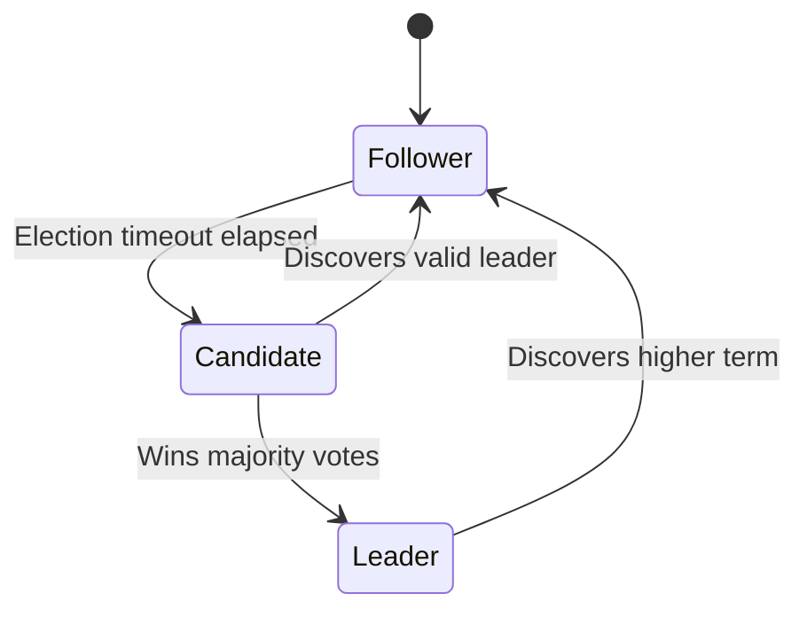

Reaching agreement among nodes in an asynchronous network subject to packet loss and server crashes is one of the foundational challenges of computer science.

## 1. Safety and Quorum Requirements

For any consensus protocol to remain safe under network partitions, state updates must be acknowledged by a strict majority of nodes:

$$Q = \left\lfloor \frac{N}{2} \right\rfloor + 1$$

Where $N$ represents the total cluster size and $Q$ is the minimal quorum. If a network partition splits a cluster of 5 nodes into partitions of size 3 and 2, only the partition with 3 nodes can commit state transitions[^1].

## 2. Leader Election Lifecycle

In Raft, nodes transition between three distinct roles: `Follower`, `Candidate`, and `Leader`.

## 3. Protocol Comparison



- **Understandability**: Decomposed into distinct subproblems (leader election, log replication, safety).
- **Leadership**: Strong leader requirement. All client writes must pass through the leader.
- **Used by**: etcd, HashiCorp Consul, CockroachDB.


- **Symmetric Architecture**: Allows pipelined consensus proposals.
- **Complexity**: Highly generalized, making correct implementations notoriously difficult.
- **Used by**: Google Spanner, Apache ZooKeeper (ZAB variant).



## 4. Failure Recovery

> [!WARNING]
> Split-brain scenarios occur if two nodes simultaneously believe they are the legitimate leader for the same term. Raft prevents this through randomized election timers and single-vote-per-term constraints.


1. When connectivity is restored between partitioned nodes, the isolated leader will discover incoming heartbeats carrying a higher term number.
2. The isolated leader immediately steps down and reverts to `Follower` state.
3. Uncommitted logs from the minority partition are overwritten by the authoritative log from the majority leader.


[^1]: The minority partition is unable to satisfy the quorum inequality $Q \le 2$, thus rejecting new writes to guarantee safety.
