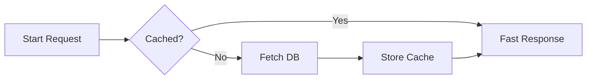

This post showcases the rich interactive components built into the Damodar theme.

## Multi-Language Code Tabs

Compare commands or code variants across package managers and languages:



```go
package main

import "fmt"

func main() {
    fmt.Println("Hello from Damodar in Go!")
}
```


```python
def main():
    print("Hello from Damodar in Python!")

if __name__ == "__main__":
    main()
```


```rust
fn main() {
    println!("Hello from Damodar in Rust!");
}
```



## Collapsible Accordion

Use the `details` shortcode to tuck away deep explanations, solution spoilers, or reference listings:


This collapsible section renders **markdown formatting**, `code blocks`, and links without cluttering the main reading flow.

- Accessible `<details>` and `<summary>` HTML5 semantics
- Smooth chevron indicator animation
- Customizable initial state via `open=true` or `open=false`


## Visual File Tree

Present clear folder and file hierarchies with automated SVG folder and document icons:


- content/
  - posts/
    - first-post.md
  - notes/
    - components-showcase.md
- layouts/
  - _default/
    - baseof.html
    - single.html
- assets/
  - css/
    - main.css
  - js/
    - main.js
- hugo.toml


## Footnotes & In-Place Popovers

Footnotes in markdown provide unobtrusive citations[^1] that you can inspect by hovering or tapping without jumping to the bottom[^2] of the screen.

## Mermaid Diagrams

Diagrams automatically adapt their color theme live whenever you toggle between light and dark mode:



## KaTeX Equations

Render mathematical notation inline like $E = mc^2$ or as a standalone display block:

$$f(x) = \int_{-\infty}^\infty \hat{f}(\xi)\,e^{2 \pi i \xi x}\,d\xi$$

[^1]: This is an interactive footnote popover rendered inline right near your cursor!
[^2]: Notice how the screen doesn't jerk down to the bottom of the page when you preview this note.
